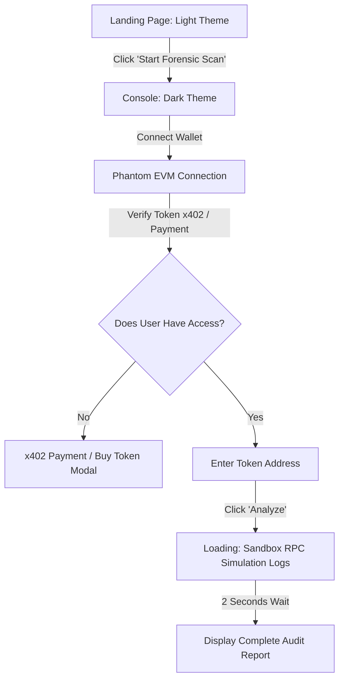

# Project Brief: Fable Hood ($FOOD)
**Forensic Scan & Asset Security Platform for Robinhood Chain**

---

## 1. Ringkasan Proyek (Executive Summary)
**Fable Hood ($FOOD)** adalah platform keamanan desentralisasi (DeFi Security) dan audit forensik pintar yang dibangun khusus untuk **Robinhood Chain** (Arbitrum Orbit L2). Platform ini memetakan, mendeteksi, dan menganalisis risiko dari smart contract, tokenized Real-World Assets (RWA), dan liquidity pool sebelum pengguna berinteraksi atau menandatangani transaksi. 

Platform ini hadir dengan transisi visual unik (Light Mode ke Dark Mode) untuk memberikan kesan konsol investigasi forensik premium yang aman dan mutakhir.

---

## 2. Tujuan Proyek (Project Objectives)
- **Trust & Safety**: Menyediakan alat deteksi instan terhadap ancaman *honeypot*, manipulasi pajak (*tax spikes*), dan penarikan likuiditas (*rug pulls*).
- **Seamless Web3 Entry**: Mempermudah login satu klik menggunakan **Phantom Wallet** (EVM compatible).
- **Monetisasi Inovatif**: Mengintegrasikan gerbang akses berbasis **Protokol Tokenisasi x402** (fraksionalisasi aset NFT/ERC-20).

---

## 3. Fitur Utama (Key Features)

### A. Login & Autentikasi (Phantom Wallet Integration)
- Menggunakan Phantom Wallet SDK/Adapter untuk jaringan EVM.
- Menampilkan status koneksi dompet pada bar navigasi (Alamat terpotong, saldo, dan avatar mascot).
- Memungkinkan tanda tangan pesan (*message signing*) aman berbasis **SIWE (Sign-In with Ethereum - EIP-4361)** untuk verifikasi kepemilikan akun. Sesi diamankan menggunakan *cryptographic nonce* acak di backend untuk mencegah *Replay Attack*.

### B. Robinhood L2 Token Scanner (Forensic Engine)
- Input kontrak pintar (0x...) dengan **input sanitization regex** ketat (`^0x[a-fA-F0-9]{40}$`) di frontend & backend.
- Mendeteksi:
  - **Honeypot Sandbox**: Simulasi transaksi beli, transfer, dan jual.
  - **Liquidity Lock Verification**: Audit sisa waktu penguncian likuiditas pool di DEX.
  - **Ownership Scanner**: Memeriksa status renounced atau kepemilikan mutlak.
  - **Dynamic Tax integrity**: Mendeteksi perubahan parameter fee/pajak setelah block tertentu.
- Tampilan log simulasi bergaya terminal/konsol forensik secara real-time.
- **Cache TTL & Live Override**: Hasil audit di-cache maksimal **15 menit** untuk menghindari eksploitasi cache lama (*Cache Poisoning*) oleh developer jahat. Menyediakan tombol "Force Re-scan" berbayar untuk audit real-time block terkini.

### C. Gerbang Pembayaran x402 (x402 Payment & Access Gate)
- Menggunakan standard token **x402** yang menggabungkan kegunaan ERC-20 (likuiditas pecahan) dan ERC-721 (kepemilikan unik).
- **Token Gating**: Pengguna harus memiliki minimal jumlah fraksi tertentu dari token $FOOD untuk membuka detail analisis lanjutan (Advanced Forensics).
- **Micro-Payment**: Opsi pembayaran instan menggunakan ETH di Robinhood L2 jika pengguna tidak memiliki token $FOOD.
- **SLA & Transaction Locking**: Saldo x402 diverifikasi tepat pada nomor block saat simulasi scan dimulai untuk mencegah manipulasi saldo ganda (*double-spend balance race condition*).

---

## 4. Estetika & Panduan Desain (Design System)

### Warna & Tema
- **Tema Halaman Utama (Light Base)**: Menggunakan Off-White (`#fafbf9`) sebagai warna dasar, abu-abu muda (`#f3f5f0`) untuk layout, dan putih bersih (`#ffffff`) pada kartu informasi.
- **Tema Konsol Forensik (Dark Base)**: Menggunakan warna gelap pekat (`#050806`) dengan tekstur dot grid neon redup.
- **Emerald Green (`#14814f` / `#0a4b30`)**: Indikator status aman (*SECURE* / *PASS*) dan elemen navigasi aktif.
- **Soft Orange (`#e4713c` / `#f2a17a`)**: Aksen kehangatan maskot dan tombol aksi utama (*Primary Actions*).
- **Red (`#d32f2f`)**: **Hanya digunakan untuk status bahaya/peringatan** (misalnya bendera *tax-spike*).

### Tipografi
- **Headlines**: Space Grotesk (modern, geometris, futuristik).
- **Body Copy**: Inter (sangat mudah dibaca).
- **Data/Logs**: JetBrains Mono (estetika developer/terminal).

---

## 5. Alur Pengguna (User Flow)

---

## 6. Spesifikasi Teknis (Tech Stack Spec)
- **Frontend**: Next.js 14 (App Router) / React / Tailwind CSS / Framer Motion.
- **Web3 Libraries**: Wagmi, Viem, atau Ethers.js untuk interaksi blockchain.
- **Wallet Connection**: `@solana/wallet-adapter` atau `@web3-onboard` / RainbowKit dengan Phantom EVM support.
- **Database & ORM**: Supabase (PostgreSQL) & Drizzle ORM.
- **AI Integration**: Anthropic Claude SDK (`@anthropic-ai/sdk`) untuk cognitive safety audit.
- **Rate Limiter**: `@upstash/ratelimit` berbasis Upstash Redis (mencegah DDoS / spamming scan API).
- **Smart Contract Interaksi**: Robinhood Chain Arbitrum Orbit Node RPC (dengan konfigurasi **Fallback RPC Nodes** jika terjadi downtime).
- **x402 Protocol contract**: Standard ERC-404 / x402 smart contract verification queries.

---

## 7. Pola Implementasi Teknis (Mengadopsi Pola Veliq & NoCap)

Untuk mempercepat pengembangan, Fable Hood akan meniru dan mengadaptasi pola kode produksi yang teruji dari repository `Veliq-nietzschean` dan `NoCap`:

### A. Pola Deteksi & Simulasi Token (Robinhood Chain L2)
*Diadaptasi dari `NoCap/chains/robinhood/client/client.ts`*
- **JSON-RPC Calls**: Mengakses node Robinhood L2 (`https://rpc.robinhoodchain.com`) menggunakan RPC payload standard untuk query state blockchain:
  - `eth_getCode`: Untuk menarik raw bytecode dan memindai tanda backdoor/fungsi mencurigakan (seperti dynamic tax ramps).
  - `eth_call`: Untuk melakukan simulasi dry-run transaksi buy/sell secara remote tanpa gas.
- **Honeypot Sandbox Logic**: Menggunakan mock sandbox logic untuk memblokir alamat yang memiliki signature rug/honeypot (contoh: memblokir transfer jika alamat target berakhiran `000` dengan pesan return `HONEYPOT_DETECTED_TRANSFER_BLOCKED`).
- **Blockscout Integration**: Meniru `BlockscoutExplorerAdapter` untuk menarik riwayat transaksi deployer dan mengidentifikasi konsentrasi holder/kegiatan bot sniper awal.

### B. Koneksi Dompet Phantom EVM
*Diadaptasi dari `Veliq-nietzschean/src/components/TokenScanner.tsx`*
- **Phantom EVM Provider**: Menginisialisasi koneksi wallet melalui provider EVM Phantom (`window.phantom?.ethereum || window.ethereum`).
- **Autentikasi Terpercaya**: Menggunakan metode `ethereum.request({ method: 'eth_requestAccounts' })` untuk sinkronisasi alamat wallet secara instan dengan modal penanganan error jika ekstensi Phantom tidak terdeteksi.
- **Sinkronisasi Sesi**: Alamat wallet yang terkoneksi langsung disinkronkan secara real-time ke session state global.

### C. Pembayaran & Token Gating (Protokol x402)
*Diadaptasi dari Pola Billing `Veliq-nietzschean/src/components/TokenScanner.tsx` & `NoCap/apps/web/src/app/page.tsx`*
- **x402 Gating Verification**: Viem/Ethers.js membaca state saldo token $FOOD (x402) milik pengguna. Jika saldo mencukupi ketentuan minimal, akses scan langsung dibuka tanpa potongan biaya.
- **Micro-transaction Fallback**: Jika saldo $FOOD tidak mencukupi, sistem akan menyusun transaksi transfer gas (ETH) sebesar `0.001 ETH` ke wallet treasury platform menggunakan `eth_sendTransaction` via Phantom.
- **Safety Polling**: Mengadopsi mekanisme manual polling signature transaksi menggunakan interval `getSignatureStatus` / `getTransactionReceipt` selama 60 detik sebelum memberikan status scan "CONFIRMED".

### D. Struktur Database & Supabase Caching
*Diadaptasi dari `NoCap/apps/web/src/app/api/v1/scan/route.ts`*
- **`wallet_profiles` Table**: Menyimpan reputasi wallet peluncur/deployer, rata-hari umur wallet, serta flags sniper history.
- **`wallet_sessions` Table**: Melacak login wallet user dan tautan notifikasi jika ada.
- **`scans` / `tokens` Table**: Menyimpan log audit hasil scanning yang telah selesai dilakukan sebagai cache. Saat address yang sama dipanggil, sistem memuat data cache ini terlebih dahulu untuk menghemat limit panggilan RPC.
- **`predictions` & `outcomes` Tables**: Mengawasi akurasi hasil verdict scan dengan hasil pergerakan harga/transaksi asli token di masa depan (analisis performa filter rug-check).

### E. Integrasi Model AI & MCP Server (Format UAIM & Claude Audit)
*Kombinasi Pola MCP Server `NoCap/packages/mcp/src/server.ts` & AI Cognitive Scan `Veliq-nietzschean/src/app/api/stache/scan/route.ts`*
- **Format UAIM (Unified Asset Integrity Model)**: Fable Hood akan meniru format data `@nocap/engine` untuk menormalisasi audit smart contract menjadi model data terstandar (menyimpan detail `socials`, `poolVenue`, `lpCustody` status, dan `controlSurface` seperti modifikasi authority).
- **Ekspos MCP Server**: Membangun server MCP berbasis StdIO menggunakan `@modelcontextprotocol/sdk` dengan dua tool utama:
  - `check_asset(chainId, address)`: Menerima data scan asset untuk agen AI eksternal.
  - `check_wallet(chainId, address)`: Memberikan data reputasi pembuat asset.
- **AI-Powered Cognitive Scan (Claude Integration)**: Menggunakan SDK `@anthropic-ai/sdk` (seperti pada Veliq) untuk mengirim detail data onchain (hasil pembacaan saldo, creator prior launches, dan bytecode) ke model Claude. System prompt akan memandu Claude untuk mensintesis hasil audit menjadi output data JSON terstruktur yang valid secara dinamis (berisi `trustScore` integer, `riskLevel` status, dan array penjelasan `findings` keamanan).

### F. Skema Database Supabase (Drizzle ORM / SQL)
*Meniru skema data di `NoCap/apps/web/src/app/api/v1/scan/route.ts`*

1. **`wallet_profiles`** (Penyimpanan Reputasi Wallet):
   - `address` (text, primary key) - Alamat EVM wallet pembuat atau trader.
   - `first_tx_timestamp` (timestamp) - Tanggal transaksi pertama di blockchain.
   - `tx_count` (integer) - Total riwayat jumlah transaksi wallet.
   - `funder_type` (text) - Jenis pendana awal (e.g. `'cex'`, `'deployer'`, `'organic'`).
   - `reputation_flags` (text[]) - Tag reputasi (e.g. `['known_sniper']`, `['rug_creator']`).
   - `launches` (integer) - Jumlah token/kontrak yang pernah dideploy.
   - `dead_under_10m` (integer) - Jumlah token mati di bawah 10 menit setelah rilis.
   - `avg_extraction_sol` (numeric) - Rata-rata dana yang ditarik per rug-pull.
   - `funded_snipers` (integer) - Jumlah sniper yang didanai langsung oleh wallet ini.
   - `trust` (numeric) - Skor kepercayaan dasar (0.0 sampai 1.0).
   - `updated_at` (timestamp) - Waktu update profil terakhir.

2. **`wallet_sessions`** (Manajemen Sesi Hubungan Web3 dengan Perlindungan Replay):
   - `id` (uuid, primary key) - Identifier sesi.
   - `address` (text, foreign key) - Terhubung ke `wallet_profiles.address`.
   - `nonce` (text) - Cryptographic nonce acak sekali pakai untuk validasi SIWE.
   - `created_at` (timestamp) - Tanggal pembuatan sesi.
   - `expires_at` (timestamp) - Batas waktu kedaluwarsa sesi (mencegah *session hijacking*).
   - `tg_chat_id` (text, optional) - Hubungan notifikasi telegram.
   - `active` (boolean) - Status aktif sesi.

3. **`scans` / `tokens`** (Caching Data Hasil Audit dengan TTL):
   - `address` (text, primary key) - Kontrak aset Robinhood L2 yang diaudit (EIP-55 Address Checksum).
   - `name` (text) - Nama aset.
   - `symbol` (text) - Simbol.
   - `trust_score` (integer) - Hasil skor keselamatan audit (0-100).
   - `risk_level` (text) - Tingkat risiko (`SAFE`, `LOW`, `MEDIUM`, `HIGH`, `CRITICAL`).
   - `verdict` (text) - Penjelasan teks kesimpulan.
   - `findings` (text[]) - Array temuan kelemahan kode.
   - `scan_data` (jsonb) - Raw UAIM JSON audit lengkap.
   - `scanned_at` (timestamp) - Tanggal scan (cache kedaluwarsa otomatis dalam 15 menit).

